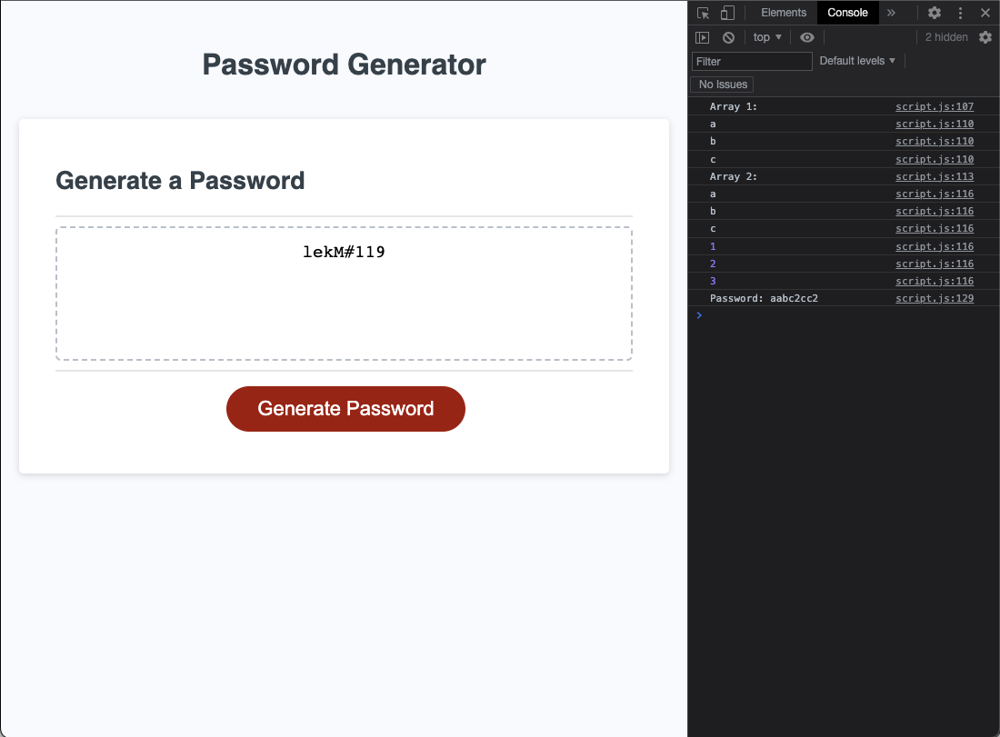

# Challenge 03 Password Generator

## Description

The password generator was the third challenge in our web development bootcamp. It was designed to challenge us with applying 
what we had learned that week about JavaScript. Some of the new tools I used were:
- Prompting the user for input and storing that input into a variable
- Using a confirm statement to give the user yes or no options
- Using methods to listen for user generated events

## Installation

N/A

## Usage

To generate a new password click on the red button. The application should then display a series of prompts to collect information
on how long you want your password to be and what type of characters you would like included. Then after you have entered an acceptable password length (between 8 and 128 charcters) and made at least one character selection your new password will be displayed in the dislay box.


    ```md
    
    ```

## Credits

N/A

## License

N/A